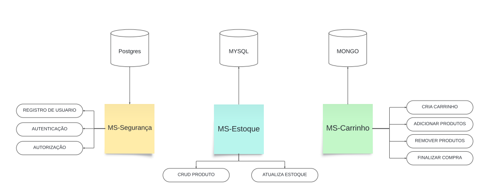

# Tech Challenge - Sistema de e-commerce - FIAP Arquitetura de Sistemas em Java - 5º Fase

Este sistema de e-commerce foi desenvolvido para permitir que os usuários realizem cadastro, login, gerenciem itens e mantenham um carrinho de compras, além de simular o processo de pagamento.
O sistema é baseado no framework Spring Boot, utiliza Spring Security para autenticação e autorização, e é construído seguindo a arquitetura de microserviços, garantindo segurança e escalabilidade.

## Tecnologias Adotadas

- **Java 17**: Linguagem de programação utilizada para o desenvolvimento do sistema.
- **Spring**: Framework utilizado para a construção de aplicativos Java.
- **Rest template**: Biblioteca utilizada para comunicação entre os micro serviços.
- **Docker**: Plataforma de software que permite a criação, o envio e a execução de aplicativos em contêineres.
- **MongoDB**: Banco de dados não relacional utilizado para persistir as informações relacionadas aos quartos e outras entidades do sistema.
- **MySQL**: Banco de dados relacional utilizado para armazenar outras informações do sistema.
- **Postgres**: Outro banco de dados relacional utilizado para armazenamento de dados específicos do sistema.
- **Spring Security e JWT**: Bibliotecas responsavels por efetuar a camada de segurança da aplicação fornecendo a autenticação e autorização dos usuários e geração dos tokens.
- **SonarLint** é um software detector, em tempo real, de códigos fora de padrão – que geram dificuldades de manutenção , bugs e vulnerabilidades. Foi muito importante a sua utilização para termos uma escrita correta e segura, aplicamos em todas as classes do projeto com exceção as de testes.
- **CheckStyle** é um analisador estático de código para checar se o código fonte está de acordo com as regras de codificação, este software nos ajudou a atendermos os requisitos da utilização de boas práticas em nosso código.
## Arquitetura de Microserviços

O sistema é composto por vários microserviços, cada um responsável por um conjunto de funções relacionadas:



Cada microserviço interage com seu próprio banco de dados para garantir a independência e a eficiência na gestão dos dados.

### Microserviços do Sistema

### 1. MS-Seguranca

**Cadastro de usuários**

Metodo **POST**

**URL** http://localhost:8081/users

```json
{
  "login": "teste",
  "password": "123456",
  "cpf": "46181856005",
  "email": "teste@hotmail.com",
  "role": "ADMIN ou USER"
}
```
---

**Listar todos usuários**

Metodo **GET**

**URL** http://localhost:8081/users

---

**Listar usuário por ID**

Metodo **GET**

**URL** http://localhost:8081/users/{id}

---

**Autenticar**

Metodo **POST**

**URL** http://localhost:8081/auth/login
```json
{
    "login":"teste",
    "password":"123456"
}
```

**/login**  é necessário informar o Login e a senha cadastrados anteriormente. Caso essas informações estejam corretas será gerato um TOKEN atraves da biblioteca JWT que terá validade de 4 horas e será necessários para utilzar o restante do sistema.

---
**Validar**

Metodo **GET**

Headers **Authorization Bearer {token}**

**URL** http://localhost:8081/auth/validate

**/validade** é um endpoint criado para ser chamado pelos outros microserviços para realizar a validação do token informado.

---

### 2. MS-Estoque
**Para utlizar os serviços presente no ms-estoque já é necessário estar logado no sistema(Possuir um TOKEN valido).**

**Criar produto**

Metodo **POST**

Headers **Authorization Bearer {token}**

**URL** http://localhost:8082/produto
```json
{
    "id": "1",
    "nome": "TV 22",
    "descricao": "TV LG 22 polegadas",
    "quantidade_estoque": "102",
    "preco": "435.99"
}
```
---
**Listar todos produtos**

Metodo **GET**

Headers **Authorization Bearer {token}**

**URL** http://localhost:8082/produto

---

**Listar produto por ID**

Metodo **GET**

Headers **Authorization Bearer {token}**

**URL** http://localhost:8082/produto/{id}

---

**Deletar produto**

Metodo **DELETE**

Headers **Authorization Bearer {token}**

**URL** http://localhost:8082/produto/{id}

---

**Editar produto**

Metodo **PUT**

Headers **Authorization Bearer {token}**

**URL** http://localhost:8082/produto

```json
{
    "id": "1",
    "nome": "TV 22",
    "descricao": "TV LG 22 polegadas",
    "quantidade_estoque": "102",
    "preco": "599.99"
}
```
---

**Atualizar estoque**

Metodo **PUT**

Headers **Authorization Bearer {token}**

**URL** http://localhost:8082/produto/atualizar/estoque/{produtoId}/{quantidade}

**/atualizar/estoque** Endpoint que será chamado pelos outros microserviços para alterar a quantidade de protudos

---

### 3. MS-Carrinho

**Para utlizar os serviços presente no ms-carrinho já é necessário estar logado no sistema(Possuir um TOKEN valido).**

**Criar carrinho**

Metodo **POST**

Headers **Authorization Bearer {token}**

**URL** http://localhost:8083/carrinho?login=

---

**Adicionar produto no carrinho**

Metodo **POST**

Headers **Authorization Bearer {token}**

**URL** http://localhost:8083/carrinho/adicionarproduto/{login}

```json
{
    "id":"1",
    "quantidade":1
}
```
---

**Remover produto no carrinho**

Metodo **DELETE**

Headers **Authorization Bearer {token}**

**URL** http://localhost:8083/carrinho/removerproduto/{login}

```json
1
```
---
**Listar todos carrinhos**

Metodo **GET**

Headers **Authorization Bearer {token}**

**URL** http://localhost:8083/carrinho

---

**Listar carrinho por ID**

Metodo **GET**

Headers **Authorization Bearer {token}**

**URL** http://localhost:8083/carrinho/{id}

---

## Como Executar o Projeto

Siga as etapas abaixo para executar o projeto em sua máquina local:

1. **Clone o Repositório: git clone https://github.com/ArleiPacanaro/Fase05.git
2. **Importe o Projeto na sua IDE:**

Abra o projeto em sua IDE favorita (por exemplo, IntelliJ IDEA, Eclipse) e importe-o como um projeto Maven.

3.**Execute o Docker Compose:**

Certifique-se de ter o Docker instalado em sua máquina. Navegue até o diretório raiz do projeto clonado e execute o seguinte comando: **docker compose up -d** para iniciar os contêineres do MongoDB, MySQL e Postgres.

4.**Inicie os Serviços:**

A partir da raiz do projeto altere para a pasta *ms-seguranca* e execute o seguinte comando **mvn spring-boot:run** após navegue para a pasta *ms-estoque* e execute novamente o comando **mvn spring-boot:run** após navegue para a pasta *ms-carrinho* e execute o comando **mvn spring-boot:run** pela ultima vez.

Após seguir essas etapas, o sistema estará em execução em sua máquina local e você poderá acessá-lo através dos endpoints especificados na documentação. Certifique-se de verificar se todos os serviços estão em execução corretamente antes de utilizar o sistema.

## Testes

Existe uma pasta com as Collections do Postman caso não queria seguir os exemplos acima.

### Integrantes do Grupo – Grupo 29:

- Igor Pereira Rocha Oliveira - RM 349895
- Arlei Pacanaro Lepiani - RM 350113
- William Kaminski - RM 430025
- Diogo Henrique Valente - RM 348497
- Matheus Sena - RM 348505
